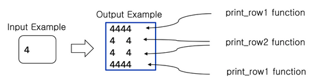
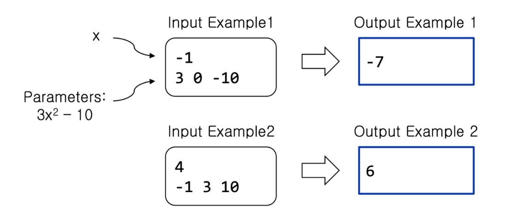

## Lab 7 — Functions

### Masala 1

###### Description

Bitta butun son `N` ni o’qing. 1 dan `N` gacha  barcha sonlar yig'indisini chop etilsin.

`add()` funksiyasi:

- Argumentlari: 2 ta butun sonlar `x` va `y`.
- Return type: `int`.
- Qaytaradi: `x` va `y` larning yig'indisi.

`main()` funksiyasi:

- `N` ni o'qiydi va yig'indi topilmaguncha `add()` funksiyani qayta-qayta chaqiradi.
- `main()` funksiyada (`+`) yoki (`-`) ishlatish mumkin emas. Increment (`++`) yoki decrement (`--`) ishlatish mumkin.

#### Input

Butun son `N`.

#### Output

`1` dan `N` gacha sonlar yig'indisini chop etilsin. Yig'indiga `N` ham kiradi.

#### Namuna 1
| Input | Output |
| - | - | 
| `10`  | `55` |

---

### Masala 2

###### Description

`A` va `B` sonlar o'qilsin va `A` dan `B` gacha bo'lgan sonlar yig'indisini hisoblansin.

- Hamisha *`A`* *`≤`* *`B`* bo'lsin.
- `sum()` funksiyasi:
    - Argumentlari: bitta butun son `N`.
    - Return type: `int`.
    - `1` dan `n` gacha sonlar yig'indisini qaytaradi. `n(n+1)/2` formuladan foydalanilsin.

#### Input

Ikkita butun sonlar `A` va `B` (`1 ≤ A, B ≤ 10000`).

#### Output

`A` dan `B` gacha yig'indini chop etilsin.

#### Namuna 1
| Input | Output |
| - | - | 
| `4 8`  | `30` |

---

### Masala 3

###### Description

`X` musbat butun son berilganda quyidagi formulaning natijasini hisoblansin: `1 + (1 + 2) + (1 + 2 + 3) + (1 + 2 + 3 + 4) + ... + (1 + 2 + 3 + ... + X)`.

- `sum()` funksiyasi:
- Argumentlari: bitta butun son `N`.
- Return type: `int`.
- 1dan `n` gacha sonlar yig'indisini qaytaradi. `n(n+1)/2` formuladan foydalanilsin.

#### Input

Bitta butun musbat son `X` (`1 ≤ X ≤ 1000`).

#### Output

Yuqoridagi formulaning natijasini chop eting.

#### Namuna 1
| Input | Output |
| - | - | 
| `4`  | `20` |

---

### Masala 4

###### Description

Bitta butun son `N` ni o'qilsin va shu son orqali namunadagidek to'rtburchak chop etilsin.

- `print_row1()` funksiyasi:
    - Argumentlari: bitta butun son `x` (`2 ≤ x ≤ 9`).
    - Return type: `void`.
    - `x` sonini bitta qatorda `x` marta chop etadi.
- `print_row2()` funksiyasi:
    - Argumentlari: bitta butun son `x` (` 2 ≤ x ≤ 9`).
    - Return type: `void`.
    - Ikki marta `x`ni va ularning orasida nechtaligi `x`ga bo'g'liq bo'lgan ***`space`*** larni chop etadi.



#### Input

Bitta butun son `N` (`2 ≤ N ≤ 9`).

#### Output

Namunadagidek to'rtburchak chop etilsin.

#### Namuna 1
| Input | Output |
| - | - | 
| `4` |`4444` <br> `4`&nbsp;`4` <br> `4`&nbsp;`4`<br>`4444`|

---

### Masala 5

###### Description

Bir nechta `x` sonlar o'qilsin va ularning orasidan 0 yoki manfiy son kiritilishidan oldin kiritilganlarining soniga mos, balandligi `x` ga bo'g'liq bo'lgan yulduzli uchburchaklar chop etilsin.

- `print_triangle` funksiyasi:
    - Argumentlari: bitta butun son `x`.
    - qaytaradi:`void`.
    - balandligi `x` ga teng bo'lgan uchburchak chop etadi.

#### Input

`0` yoki `manfiy son` kiritilishidan oldin kiritilgan sonlar.

#### Output

Har bir kiritilgan `x` son uchun balandligi `x` bo'lgan uchburchak chop eting. ***`Space`*** ishlatilmasin.

#### Namuna 1
| Input | Output |
| - | - |
| `3 -2 ` | `*` <br>`**` <br>`***` |


#### Namuna 2
| Input | Output |
| - | - |
| `5 1 3 0 ` | `*` <br>`**` <br>`***` <br>`****` <br>`*****` <br>`*` <br>`*` <br>`**` <br>`***` |

---

### Masala 6

###### Description

$x$ ning qiymatini o'qilsin va quyidagi funksiyaning javobini chop etilsin:

 $f(x) = 2x^2 - 5x + 1$

- `func()` funksiyasi:
    - Argumentlari: 1 ta butun son $x$.
    - Return type: `int`.
    - $f(x)$ funksiyaning javobini qaytaradi.
- `main()` funksiyasi:
    - $x$ ning qiymatini o'qiydi, `func()` funksiyani chaqiradi va natijani chop etadi.

> Masalan, 2 kiritilsa, $2 * 2^2 - 5*2 + 1$ $= -1$ bo'ladi. Demak, 2 kiritilsa -1 chop etilishi kerak.
> 

#### Input

- Bitta butun son `x`.

#### Output

$f(x)$ funksiyaning javobini chop etilsin.

#### Namuna 1
| Input | Output |
| - | - |
| `4 ` | `13` |

---

### Masala 7

###### Description

Kvadrat ($f(x) = ax^2 + bx + c$) funksiyaning javobini qaytaradigan funksiya yozing.

- `func()` funksiyasi:
    - Argumentlari: 4 ta butun sonlar x, a, b, c.
    - Return type: `int`.
    - Formulaning javobini qaytaradi: $ax^2$ $+ bx + c$.
- `main()` funksiyasi:
    - 4 ta sonni o'qiydi, `func()` funksiyani chaqiradi va natijani chop etadi.



#### Input

- Birinchi qatorda `x`ning qiymati o'qilsin.
- Ikkinchi qatorda mos ravishda `a`, `b`, `c`larning qiymati bitta qatorda, shu tartibda o'qilsin.

#### Output

Kvadrat funksiyaning javobini chop etilsin.

#### Namuna 1
| Input | Output |
| - | - |
| `-1` <br>`3 0 -10` | `-7` |

---

### Masala 8

###### Description

### 7-masalaning davomi

Ikkita kvadrat funksiyalar $f(x)$ va $g(x)$ uchun $g(f(x))$ funksiyaning javobini qaytaradigan dastur tuzing.

- `func()` funksiyasi:
    - Argumentlari: 4 ta butun sonlar x, a, b, c.
    - Return type: `int`.
    - Formulaning javobini qaytaradi: $ax^2$ $+ bx + c$.
- `main()` funksiyasi:
    - $x$ ni va ikkita funksiya uchun ularning ***a, b, c*** parametrlarini o'qiydi, `func()` funksiyani chaqiradi va natijani chop etadi.

> Masalan, x = 2, f(x) va g(x) funksiyaning parametrlari mos ravishda 3, 2, 1 va -1, 8, 4 bo'lsa $f(x) = 3*2^2+2*2+1=17$ va $g(f(x)) = -1*17^2+17*8+4=-149$ bo'ladi.
> 

#### Input

- Birinchi qatorda `x`ning qiymati o'qilsin.
- Ikkinchi qatorda mos ravishda $f(x)$ funksiyaning `a`, `b`, `c` qiymatlari bitta qatorda, shu tartibda o'qilsin.
- Uchinchi qatorda mos ravishda $g(x)$ funksiyaning `a`, `b`, `c` qiymatlari bitta qatorda, shu tartibda o'qilsin.

#### Output

g(f(x)) funksiyaning javobini chop etilsin.

#### Namuna 1
| Input | Output |
| - | - |
| `-1` <br>`3 0 -10` <br>`1 -3 1` | `71` |

---

### Masala 9

###### Description

Yakunlovchi shart bajarilmaguncha sonlar o'qilsin va eng kattasi va ikkinchi eng kattasini chop etilsin.

- Son o'qishni yakunlovchi shart: `0` kiritish (`0`kiritishdan avval kamida `2` ta son o'qilishi kerak).
- global o'zgaruvchilar `max1` va `max2` lardan foydalanilsin.

`update()` funksiyasi:

- Argumentlari: bitta butun son `x`.
- Return type: `void`.
- Eng katta sonni `max1` ga va ikkinchi eng katta sonni `max2`ga o'zlashtiradi.

`main()` funksiyasi:

- Sonlarni o'qiydi, `update()` funksiyani qayta-qayta chaqiradi, `max1` va `max2` larni aniqlab, chop etadi.

#### Input

`0` kiritilmaguncha sonlar o'qilsin. `0` dan avval kamida `2` ta son o'qilsin.

#### Output

Kiritilgan sonlarning eng kattasini va undan keyingi ikkinchi eng kattasini bitta qatorda, orasida bitta ***space*** bilan chop etilsin.

#### Namuna 1
| Input | Output |
| - | - |
| `22 -81 33 27 45 -23 0`  | `45 33` |

---

### Masala 10

###### Description

Agar berilgan sonning har bir raqami arifmetik progressiya hadlari bo'lsa, shu son `Magic Son` deb ataladi. Arifmetik progressiya deb hadlari o'rtasidagi farq konstant bo'lgan ketma-ketlikka aytiladi.

Berilgan `N` sonigacha nechta `Magic Son` borligini aniqlovchi dastur tuzilsin.

- `magicSon` funksiyasi:
    - Argumentlari: butun son`x`;
    - Berilgan `x` son `Magic Son` yoki yo'qligini aniqlaydi. Agar son `Magic Son` bo'lsa `1` ni, yo'qsa `0` ni qaytaradi.

#### Input

Bitta butun musbat son `N` (`1 ≤ N ≤ 1000`).

#### Output

Berilgan songacha `Magic Son` lar nechta ekanini chop etilsin.

#### Namuna 1
| Input | Output |
| - | - |
| `110` | `99` |

#### Namuna 2
| Input | Output |
| - | - |
| `1` | `1` |

#### Namuna 3
| Input | Output |
| - | - |
| `210` | `105` |

#### Namuna 4
| Input | Output |
| - | - |
| `1000` | `144` |

---

### Masala 11

###### Description

`N` ta kiritilgan sonlarning nechtasi `musbat` ekanini aniqlaydigan dastur tuzilsin.

- `isPositive()` funksiyasi:
    - Argumentlari: bitta butun son `x`.
    - Agar son musbat bo'lsa `1` ni, yo'qsa `0` ni qaytaradi.
- `readNumbers()` funksiyasi:
    - Argumentlari: bitta musbat butun son `N`.
    - `N` ta son o'qiydi va musbatlari sonini qaytaradi.

> Musbat sonlar deb 0 dan katta sonlarga aytiladi.

#### Input

- Birinchi qatorda musbat son `N` (`1 ≤ N ≤ 1000`).
- Keyingi qatorda `N` ta butun sonlar.

#### Output

Kiritilgan sonlarning musbatlari sonini chop etilsin.

#### Namuna 1
| Input | Output |
| - | - | 
| `5` <br> `1 2 -2 1 0` | `3` |

---

### Masala 12

###### Description

`ATM` mashinasi karta kiritilgan paytda, avvalo, `parol` orqali foydalanuvchining shaxsini tasdiqlaydi. 
ATM `4` yoki `6` xonali parollarni qabul qiladi.

Parol kiritilganda u to'g'ri yoki no'to'gri formatda ekanini aniqlaydigan dastur tuzilsin.

- `isCorrectFormat()` funksiyasi:
    - argumenti bitta butun musbat son `parol`.
    - agar kiritilgan parol `4` yoki `6` xonali bo'lsa `1` ni, yo'qsa `0` ni qaytaradi.
- `main()` funksiyasi:
    - `parol` ni o'qiydi va `isCorrectFormat` funksiyani chaqirib, parol to'g'ri yoki noto'g'ri formatda ekanini aniqlaydi.

#### Input

Bitta butun musbat son `N` ($1 ≤ N ≤ 2^{32}−1$).

#### Output

Agar kiritilgan son to'g'ri formatda bo'lsa `1` ni, yo'qsa `0` ni chop eting.

#### Namuna 1
| Input | Output |
| - | - | 
| `1234` | `1` |

#### Namuna 2
| Input | Output |
| - | - | 
| `12345` | `0` |

---

### Masala 13

###### Description

Butun musbat sonning `ikkilik sanoq` tizimi(`binary`)dagi ko'rinishida nechta `1` lar borligini aniqlaydigan dastur tuzing.

- `countOnes` funksiyasi:
    - Argumentlari: bitta butun musbat son `n`.
    - Berilgan `n` sonini ikkilik sanoq tizimidagi ko'rinishida nechta `1` lar qatnashganini qaytaradi.
    
    > Masalan: countOnes(5) --> 2, chunki 5ning ikkilik sanoq tizimidagi ko'rinishi 101ga teng.
    > 

#### Input

Bitta butun musbat son `N` ($1 ≤ N ≤ 2^{32}−1$).

#### Output

Berilgan sonning ikkilik sanoq tizimidagi ko'rinishida mavjud bo'ladigan `1` lar soni.

#### Namuna 1
| Input | Output |
| - | - | 
| `5` | `2` |

---

### Masala 14

###### Description

**`Perfect Son`** deb o'zidan boshqa barcha bo'luvchilari yig'indisiga teng songa aytiladi.

> Masalan: 6 --> 1 + 2 + 3 = 6, sonning bo'luvchilari yig'indisi shu sonning o'ziga teng. 28 --> 1 + 2 + 4 + 7 + 14 = 28.
> 
- `isPerfect()` funksiyasi:
    - Argumentlari: bitta musbat butun son `n`.
    - Agar `n` perfect son bo'lsa `1`ni, yo'qsa `0`ni qaytaradi.

Kiritilgan son perfect son bo'lsa `1` ni, yo'qsa `0` ni chop eting.

#### Input

Bitta butun musbat son `N` (`1 ≤ N ≤ 99999`).

#### Output

Kiritilgan son perfect son bo'lsa `1` ni, yo'qsa `0` ni chop eting.

#### Namuna 1
| Input | Output |
| - | - | 
| `28` | `1` |

#### Namuna 2
| Input | Output |
| - | - | 
| `4` | `0` |

---

### Masala 15

### Kichkina Shahzoda

###### Description

Kichik shahzoda o'z planetasida yashaydi. Uning malikasi esa boshqa planetada. Kichik shahzoda malikaning xavfda ekanidan xabar topadi va uni qutqarishga yo'lga otlanadi. Afsuski, uning raketasi unchalik kuchli emas. Shuning uchun, u yo'lda iloji boricha kamroq planeta kesib o'tishiga to'g'ri keladi. Quyidagi xarita *Somon Yo'li* galaktikasining Kichik Shahzoda sayohat qiladigan qismini ko'rsatadi.


Qizil chiziq shahzodani planeta hududiga eng kam kirish/chiqish orqali yetish yo'lini anglatadi. Aylanalar planetalar chegaralarini. Eng kam kirish/chiqish bajariladigan yo'llar ko'p, lekin qay yo'l bilan bormasin kamida 3 marta planeta chegarasini kesib o'tishiga to'g'ri keladi. Shahzodaning va malikaning koordinatalari berilgan bo'lsa, shahzoda necha marta planeta chegarasini kesib o'tishga majbur ekanini aniqlaydigan dastur tuzing. 

(Masala shartida planetalar chegaralari ustma-ust tushmaydi va bir-birini kesib o'tmaydi. Shuningdek, shahzoda va malika koordinatalari hech qachon chegara ustida bo'lmaydi).

#### Input

Birinchi qatorda `testcase` lar soni T berilsin. Keyingi qatordan boshlab, har bir `testcase` ning birinchi qatorida shahzoda $(x_1,y_1)$ va malikaning $(x_2,y_2)$ koordinatalari berilsin. `Testcase` ning ikkinchi qatorida planetar soni $n$ berilsin. Keyingi $n$ta qatorning har birida planeta markazi $(c_x,c_y)$ va radiusi $r$ berilsin.

(−1000 ≤ $x_1$, $y_1$, $x_2,y_2, c_x, c_y ≤ 1000, 1 ≤ r, T ≤ 1000, 1 ≤ n ≤ 50$)

#### Output

Har bir `testcase` uchun shahzoda nechta planeta chegarasini kesib o'tishga majburligini alohida qatorlarda chop etilsin.

#### Namuna 1
| Input | Output |
| - | - | 
| `2`<br>`-5 1 12 1`<br>`7`<br>`1 1 8`<br>`-3 -1 1`<br>`2 2 2`<br>`5 5 1`<br>`-4 5 1`<br>`12 1 1`<br>`12  1 2`<br>`-5 1 5 1`<br>`1`<br>` 0 0 2` | `3`<br>`0` |


<br>
### Masala 16

## Sekund => `Soat:Minut:Sekund`

> Quyidagi talablarga mos keluvchi metod yozing:

<br>

* Musbat sonlarni (sekundlar) qabul qilsin va ularni odamga tushunarli vaqt formati (`HH:MM:SS`)ga o'tkazib qaytarsin.
* Maksimum qabul qilinuvchi qiymat `99:59:59` bo'lsin, bu qiymatdan ortiq sekundlar kiritilganda `Error` xabarini qaytarsin.
* Manfiy son yoki `string`, `char` kabi yaroqsiz ma'lumot kiritilsa, `Error` xabarini qaytarsin.

<br>

### Yuqoridagi metod / funksiyadan foydalanib input qilinga son (soniyalar)ni `HH:MM:SS` shaklida qaytarib chop eting.

<br>

#### Input
```
Soniyalar
```
#### Output
```
HH:MM:SS
```

<br>

#### Sample input 1
| Input  | Output |
|-------|----  |
|350 | 00:05:50|                                                

#### Sample input 
|Input| Output |
|-----|--------|
| 459999 | Error |
